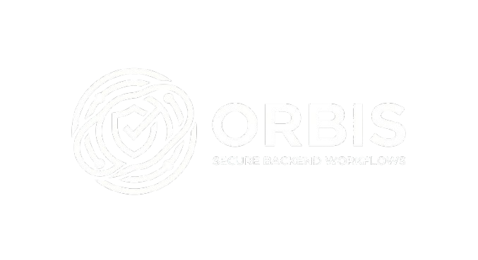

<div align="center">
  
  <h1>Orbis</h1>
  <p><strong>Secure Document Approval Workflow Backend</strong></p>
</div>

## Overview

Orbis is a backend service for document approval workflows. It helps teams:
- **Create and submit documents** for review
- **Approve or reject documents** using defined roles
- **Keep a secure audit trail** of all important actions

## Core Features

- **JWT-based Authentication** — Secure access with Bearer tokens and 1-hour expiry
- **Role-Based Access Control (RBAC)** — Three roles: ADMIN, AUTHOR, APPROVER
- **Document Workflow** — State machine with DRAFT → SUBMITTED → APPROVED/REJECTED
- **Append-Only Audit Trail** — Immutable history of all critical actions
- **Rate Limiting** — Login throttling (5 attempts per 15 minutes)
- **Validation & Error Handling** — Zod schema validation with proper HTTP status codes

## Tech Stack

- **Runtime:** Node.js 18+
- **Framework:** Express 5.2
- **Language:** TypeScript 5.3
- **Database:** Prisma ORM + SQLite
- **Auth:** JWT + bcryptjs
- **Testing:** Jest + Supertest
- **Code Quality:** ESLint + Prettier

## Project Goal

Build a strict MVP that delivers one complete end-to-end approval flow with strong security and clear API behavior.

## Quick Start

### Prerequisites
- Node.js 18+ 
- npm or yarn

### Installation

```bash
# Clone repository
git clone <repo-url>
cd orbis

# Install dependencies
npm install

# Setup environment
cp .env.example .env

# Apply database migrations
npm run prisma:migrate

# Seed initial data
npm run prisma:seed
```

### Development

```bash
# Start development server (hot reload)
npm run dev

# Build for production
npm run build

# Start production server
npm run start

# Run tests
npm test

# Lint and format
npm run lint
npm run format
```

## API Endpoints

### Authentication
- `POST /auth/login` — Login with email and password
- `GET /auth/me` — Get authenticated user info

### Users (Admin only)
- `POST /users` — Create new user
- `POST /users/:id/roles` — Assign role to user

### Documents
- `POST /documents` — Create new document (DRAFT state)
- `GET /documents` — List documents
- `POST /documents/:id/submit` — Submit document for review
- `POST /documents/:id/approve` — Approve document (APPROVER only)
- `POST /documents/:id/reject` — Reject document (APPROVER only)

### Audit Trail
- `GET /audits` — View audit log (ADMIN/APPROVER only)
- `GET /audits/documents/:id/history` — View document audit history

## Authentication

All protected endpoints require a Bearer token in the Authorization header:

```bash
curl -H "Authorization: Bearer <accessToken>" http://localhost:3001/auth/me
```

## Database Schema

- **Users** — Email, password hash
- **Roles** — ADMIN, AUTHOR, APPROVER
- **UserRoles** — Many-to-many mapping
- **Documents** — Title, content, state, owner, dates
- **AuditEvents** — Append-only event log with actor, action, target

## Orbis _ V1 
## License

MIT
